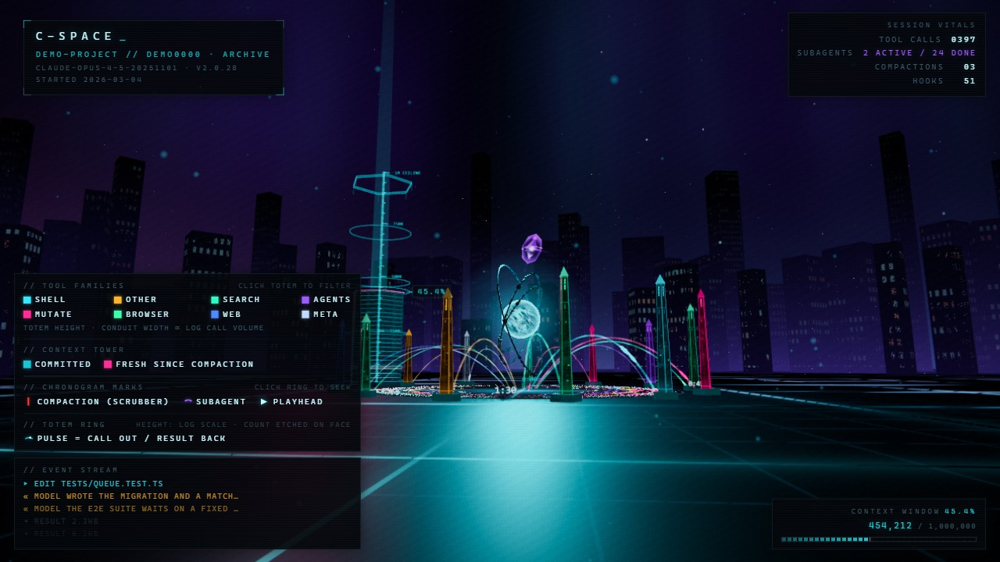
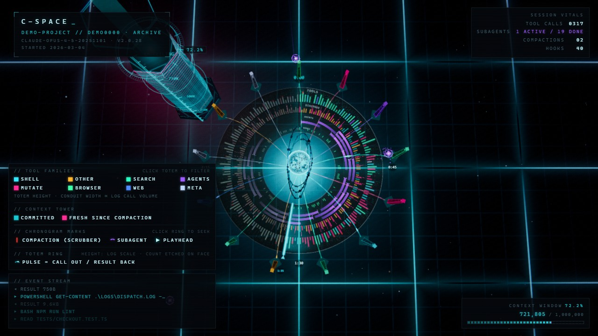
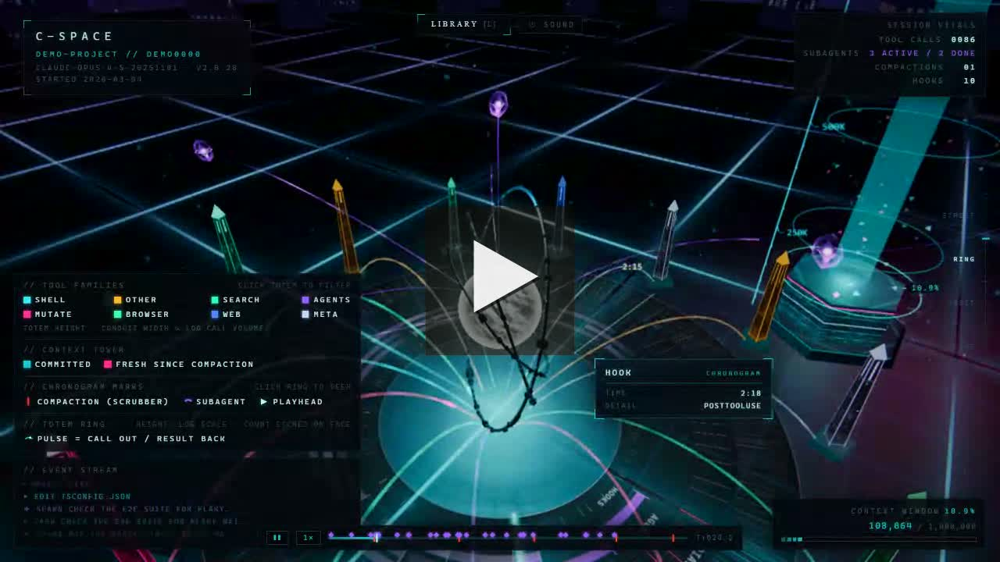

# C-Space





### 35-second tour

[](docs/video/cspace-demo.mp4)

<sub>▶ **[Click for the 35s tour](docs/video/cspace-demo.mp4)** — establishing
drift, orbit down to the tool ring, a hover card, an in-place session swap from
the library, then out to the chronogram plate. Everything above and in the video
is the bundled synthetic demo session (`npm run dev`, then `/?demo=1`) — nothing
in it comes from a real transcript.</sub>

**C-Space renders an AI coding-agent session as a place.** It reads session
transcripts **from your own machine** — Claude Code's `~/.claude/projects` is the
wired path today, with read-only adapters for Codex, Hermes and OpenClaw in
`tools/adapters/` (see **Status**) — and plays one back as a neon-noir
machine-city. **If you have no sessions on this machine (or have not opted any
project in yet, which is the default), a bundled SYNTHETIC demo session plays
instead** — so the quickstart below works immediately, with zero setup and
nothing of yours on screen.

In the city: the agent loop is a gyroscope reactor at the origin, the context
window is a tower of memory slabs growing toward a 1M-token ceiling, each tool
is a monolith on a ring with light-pulses for calls and results, subagents are
violet drones tethered to the core, and the whole session maps onto a radial
chronogram on the floor — click it to seek. It runs in two modes: **archive** (a
parsed session JSON played back over 180s) and **live** (a tail server streams a
running session over SSE, so you can watch a session think in real time). A
second page, the **fleet view**, lays every allowed session out as a city
district — one machine per session, live streams lighting up the active ones.
Every geometric property encodes a real quantity; the scene is the infographic.
Design rules are binding and live in `DIRECTION.md`.

## Quickstart

Node ≥ 22.5. Two steps, and the second one is optional.

**1. Run it.** `npm run dev` **blocks** (it is a long-running dev server), so
give it a terminal of its own:

```sh
npm install
npm run dev            # BLOCKS — Vite on http://localhost:5199 (strict port)
```

Open <http://localhost:5199>. On a fresh clone there is no session data and no
allowlist, so this boots the **bundled synthetic demo** (`public/demo/session.json`,
generated by `npm run demo` — invented start to finish, no real transcript in
it). That is the whole quickstart; everything below is opt-in.

**2. Point it at your own sessions.** In a **second terminal** (the first one is
still running Vite), start the tail server — also a **blocking** process:

```sh
npm run live           # BLOCKS — tail server on http://localhost:5198
```

The tail server exposes **only projects you explicitly allow**, so with no
config it deliberately shows nothing (it prints exactly that, plus the project
slugs it can see). In a third terminal, or after stopping it:

```sh
npm run allowlist      # discovers your projects → cspace.allowlist.json
#   → then EDIT that file and move the projects you want visible from
#     "discovered" into "allow" (nothing is exposed until you do)
npm run build-library  # optional: parse the allowed sessions so the library
#                        panel and the archive reel have real stats
```

Restart `npm run live` after editing the allowlist (it is read once at startup),
then reload the page.

| URL | What you get |
| --- | --- |
| `http://localhost:5199/` | Live-first boot, in precedence order: **(1)** if the tail server is up and exactly one allowed session is active, it streams that session live — 2+ active redirects to the fleet view; **(2)** else the parsed archive reel from `npm run build-library`, rotating the library; **(3)** else a replay of the most recent allowed session straight off the tail server; **(4)** else the **bundled synthetic demo**. A fresh clone with no setup lands on (4). |
| `http://localhost:5199/?live=1` | Live mode — streams the most recently active allowed session; falls back down the same chain (archive, then demo) if the tail server is down or has nothing allowed |
| `http://localhost:5199/fleet.html` | Fleet view — all allowed sessions as a machine district, up to 4 concurrent live streams. Needs the tail server and a non-empty allowlist — there is no demo fallback here: without them the HUD reads OFFLINE over an empty district and keeps retrying the roster |

For a production-style single-port run instead of Vite: `npm run build && npm run
start` (serves `dist/` and the tail endpoints together on 5199, and opens a
browser).

## URL parameters

All parameters apply to the main page (`index.html`) unless noted.

| Param | Values | Effect |
| --- | --- | --- |
| `t` | seconds | Seek playback to virtual time `t` (also skips the 7s intro crane) |
| `cam` | `0`–`6` | Shot preset, used with `freeze=1`: 0 wide establishing, 1 core close-up, 2 context tower, 3 totem ring low, 4 drone shell high, 5 down-the-boulevard, 6 chronogram top-down plate. On the fleet page any `cam` value freezes to the single district-overview preset |
| `freeze` | `1` | Deterministic shot mode: playback paused, seeks `t` (default 90), all events up to that point fired in one batch, UI chrome hidden. After 30 settled frames sets `window.__SHOT_READY` and retitles the page `SHOT_READY` (the screenshot pipeline waits on this) |
| `hover` | `<kind>:<key>` | Force-display the hover card for a registered pick entry at its projected position — screenshot hook for the critique loop |
| `speed` | float | Playback speed multiplier (default `1`) |
| `q` | e.g. `high` | Quality hint passed to modules via `ctx.quality` (default `high`) |
| `session` | library id | Load an archived session from `/data/library/<id>.json` instead of the flagship |
| `live` | `1` or session uuid | Live mode: `1` streams the most recent active session, a uuid streams that specific one |
| `demo` | `1` | Play the bundled synthetic session outright, even on a machine that has its own data. The only session safe to screenshot or screen-share — nothing in it came from a real transcript |

## Controls

Main page:

- **Drag** — orbit the camera (manual override; the cinematic director resumes after 6s idle)
- **Wheel** — zoom (exponential)
- **L** (or the top-center chip) — toggle the session library panel; click a row to load that archive or the live tail; **ESC** closes
- **Chronogram** (floor ring) — click anywhere on it to seek
- **Totem** — click to filter the world to that tool (its pulses and chronogram ticks stay lit, everything else dims); click again, click empty space, or **ESC** to clear
- **Hover** anything pickable — info card (totems, drones, slabs, chronogram lanes)

Fleet view (`fleet.html`):

- **Drag / wheel** — manual orbit over the district; the aerial figure-eight drift resumes after 6s idle
- **WASD / arrow keys** — engage street mode, a first-person fly-through from the current pose (no teleport)
- In street mode: **drag** = look, **Q/E** (or PageDown/PageUp) = sink/rise, **SHIFT** = sprint, **wheel** = dolly along the look ray
- **ESC** (or 10s of no input) — hand back to the aerial drift

## Sound — and the one outbound network connection

Apart from this, C-Space talks to nothing off your machine: all geometry,
shaders and textures are procedural (`DIRECTION.md` makes that binding), and the
only HTTP the page does is same-origin fetches for session JSON plus the
loopback tail server. The exception is optional ambient audio, and it is worth
being precise about.

Audio is **OFF by default**. `src/modules/audio.js` owns one `⏻ SOUND` chip
(top center) whose menu offers **OFF / RADIO / SYNTH / RADIO+SYNTH**:

- **SYNTH** is fully procedural WebAudio — oscillators plus one seeded noise
  buffer, no samples, no assets, **no network requests at all**. It sonifies the
  same events the scene draws (tool calls panned by totem azimuth, compaction
  booms, spawn arpeggios). If you want sound with zero outbound traffic, this is
  it.
- **RADIO** streams **SomaFM** — DEF CON Radio, The Trip, or Drone Zone
  (listener-supported, commercial-free, somafm.com) — from its public icecast
  mounts, on a plain `HTMLAudioElement` with an ordered failover list per
  channel. Selecting it means **your browser connects out to `ice*.somafm.com`**
  and SomaFM sees your IP like any other listener. It is a radio station, not
  telemetry: nothing about your session is sent anywhere. The menu also carries
  a credit link to somafm.com — a link you can click, not a request the page
  makes.

Nothing plays until you act. Browsers block autoplay and the module leans on
that deliberately: a stored non-OFF preference (`localStorage`, key
`cspace-audio`) only renders the chip as **armed**, and the gate opens on the
first genuine pointer/key gesture after that. Under `?freeze=1` the module is
absent entirely — no chip, no element, no context.

**Why `index.html` sets a page-wide `<meta name="referrer" content="no-referrer">`:**
SomaFM's icecast hotlink guard returns 403 for ranged GETs that carry a
`Referer`, and a media element cannot set a per-request referrer policy — so the
page sends no referrer at all. That meta tag exists for the radio bed and
nothing else.

If you would rather the option did not exist in your tree, remove `audio` from
the `MODULES` array in `src/main.js` (and the import above it); the module
contract is designed so a missing module is a non-event.

## Architecture

```
~/.claude/projects/<project>/<session>.jsonl        (Claude Code transcripts)
        │
        ├── ARCHIVE ─ tools/parse-session.mjs ──► ~/.cspace/data/session.json
        │             (or npm run build-library)    ~/.cspace/data/library/<id>.json
        │             OUTSIDE the repo; the servers │
        │             map /data/* onto it           │ fetch /data/...
        │                                                 ▼
        │                              src/main.js ── lib/timeline.js (Timeline)
        │                                                 │
        └── LIVE ─ tools/live-server.mjs :5198            │
                   │ (poll-tail + AgentWatcher,           │
                   │  tools/session-parser.mjs)           │
                   │ SSE: snapshot, then items @500ms     │
                   ├──► src/main.js  ?live=1 ── lib/liveTimeline.js
                   └──► src/fleet/fleetMain.js  (/sessions roster + ≤4 streams)
                                                          │
                                              module update loop, 60fps
```

**Module contract** (full text in the `src/main.js` header): each file in
`src/modules/` default-exports `{ name, init(ctx), update(dt, state, ctx),
resize?(w, h) }`. Modules are sandboxed — one that throws at init or update is
disabled and logged, never fatal. `ctx` carries the scene, the session, the
timeline, the palette/layout constants, the `pick` registry for hover/click,
and shared UI state (`filterTool`). Modules must import cleanly under plain
Node (no top-level DOM/GL), which is what makes the unit tests and headless
smoke checks possible. Camera presets 0–5 are frozen; the critique pipeline
depends on them.

- `src/lib/` — `palette.js` (the only source of color, plus world `LAYOUT` and
  `CHRONO` constants), `timeline.js` (archive playback: virtual-time mapping,
  seek, event firing), `liveTimeline.js` (same interface fed by SSE ingest)
- `src/modules/` — the 14 modules `main.js` mounts, in `MODULES` order:
  `environment`, `chronogram`, `core`, `contextStack`, `totems`, `drones`,
  `cameraRig`, `interact`, `post`, `hud`, `library`, `audio` (the opt-in
  soundscape, above), `zoomRail` (altitude rail + the ascend-to-fleet
  threshold), `attract` (invisible program rotation when nothing is live —
  no title cards, it just swaps sessions in place). `attract` registers last
  because its identity normalization needs `hud`'s DOM at init
- `src/fleet/` — `cityLayout`, `machines`, `fleetCamera`, `fleetInteract`,
  `fleetHud`, mounted by `fleetMain.js` with its own ctx contract
  (roster + streams)
- `tools/` — `parse-session.mjs` (batch), `session-parser.mjs` (incremental,
  shared by the live server), `live-server.mjs` (SSE tail server),
  `cspace.mjs` (single-port runner for `npm run start`), `allowlist-init.mjs`,
  `build-library.mjs`, `make-demo.mjs` (regenerates the synthetic demo
  deterministically), `cspace-paths.mjs` (the out-of-repo store), `adapters/`
- `tests/` — `npm test` (`node --test tests/*.test.mjs`) covers the parser,
  both timelines, and the source adapters

## Harnesses

C-Space is not Claude-only. Sessions are read through pluggable **source
adapters** in `tools/adapters/`, each implementing the same three functions —
`storeExists()`, `discover()`, `parse(entry)` — and each emitting the **same
event vocabulary** (`user`, `say`, `thinking`, `tool_call`, `tool_result`,
`spawn`/`despawn`, `compaction`, `hook`, `queued`, plus the context curve and
per-tool stats). Downstream the visualization never asks which harness a session
came from. `tools/adapters/index.mjs` is the registry: it hard-depends only on
the Claude adapter, loads the others when their files are present, and
`discoverAll()` returns the union of every store that exists on this machine
with each row tagged by source — one adapter throwing on a corrupt store does
not sink the others.

One caveat, because the section above reads more finished than it is: the
registry is a library with tests, **not yet wired into the app's discovery
path**. `npm run live` and `npm run build-library` still enumerate
`~/.claude/projects` directly, so a Codex/Hermes/OpenClaw session does not
appear in the library panel on its own today — you reach those stores through
`tools/adapters/` (`discoverAll()` / `getAdapter(id).parse(entry)`) and write the
result into the data store yourself. Wiring the registry into `listSessions()`
is the obvious next commit.

Every adapter is strictly **read-only** with respect to the store it reads.
SQLite-backed adapters use the built-in `node:sqlite` (Node ≥ 22.5,
experimental) behind a guarded import — no npm dependency — so a Node without it
skips the SQLite path and falls back to legacy JSONL where the harness has one.

| Adapter | Store | Status |
| --- | --- | --- |
| `claude` | `~/.claude/projects/<project>/<session>.jsonl` | **Verified.** The reference implementation; delegates to `session-parser.mjs`, the same parser the live tail uses. |
| `codex` | `~/.codex/sessions/YYYY/MM/DD/rollout-*.jsonl`, plus `~/.codex/archived_sessions/` | **Verified** against real local rollout files. |
| `hermes` | `~/.hermes/state.db` (SQLite); legacy `~/.hermes/sessions/*.jsonl` fallback | **Spec-only.** Built to the published schema, not yet validated against a live install. |
| `openclaw` | `~/.openclaw/agents/<agentId>/agent/openclaw-agent.sqlite` (per agent); legacy `.../sessions/*.jsonl` fallback | **Spec-only.** Built to the published docs, not yet validated against a live install. |

Claude and Codex are the two verified against real data. Hermes and OpenClaw are
spec-only: they read each field through name-coalescing fallbacks, mark their
guesses `needs-real-data` in comments, and leave anything the harness does not
record empty rather than faking it — neither has a subagent or hook analogue, so
those arrays stay empty.

Two structural differences are worth knowing:

- **Hermes compacts by lineage, not in place.** A `/compress` creates a **new
  child session** carrying `parent_session_id`, rather than writing a compaction
  marker into the same transcript. The adapter marks the compaction at that
  lineage boundary — the child's start — so one logical Hermes conversation can
  span several session rows.
- **OpenClaw stores a transcript tree.** Entries are append-only with
  `id`/`parentId`, so a rewind or fork leaves abandoned sibling branches in the
  store. The adapter **linearizes to the active branch** (deepest leaf; ties
  broken by latest timestamp, then storage order, then id) and ignores the rest.
  Its compaction entries also carry `tokensBefore`, the exact context size
  immediately before the collapse, so the context tower drops by a measured
  amount instead of the estimate a Claude session allows. OpenClaw stores are
  per-agent, so a single host can present several.

## Parsing your own sessions

```sh
npm run parse -- <path-to-session.jsonl> [out.json]
```

Output defaults to `~/.cspace/data/session.json` (the flagship slot). Point the
output at `~/.cspace/data/library/<id>.json` and add a row to
`~/.cspace/data/library/index.json` to make it selectable from the in-app
library panel, or load it directly with `?session=<id>` — though
`npm run build-library` does all of that for every allowed session in one pass.
The store lives **outside the repo** (`CSPACE_DATA` overrides the location) so
parsed transcripts never enter the source tree or a build; see
`tools/cspace-paths.mjs`. The parser extracts events
(tool calls/results, dialogue, thinking, hooks, queue ops), the context-window
curve from token usage, subagent spawn/despawn spans, and compactions.

## Fresh machine / macOS

A fresh clone ships **no session data** (the store is outside the repo) and
**no allowlist** (see below) — so it plays the bundled synthetic demo, and shows
nothing *of yours* until you opt a project in. To see your own sessions on a new
machine:

```sh
npm install
npm run allowlist        # discovers your projects, writes cspace.allowlist.json
#   → edit that file: move the projects you want visible into "allow"
npm run build-library    # parses the allowed sessions (stats for the library panel)
npm run build
npm run start
```

`npm run allowlist` lists every Claude Code project on the machine with its
session count and writes them to a `discovered` list — **nothing is exposed
until you move it into `allow`**, so sensitive or client work stays out by
default. Re-run it any time to see what is allowed, what is available, and
whether a configured slug does not exist on this machine (the usual cause of
an empty C-Space: slugs are OS-specific).

The runner works cross-platform (Windows `start`, macOS `open`, Linux
`xdg-open`). Once your allowlist is set, first boot replays the most recent
allowlisted session straight from the tail server — no parsing needed — or
goes live immediately if a session is active. To seed archive stats for the
library panel, run `npm run build-library` (parses every allowlisted session).

## Privacy: the project allowlist

Session transcripts are sensitive, so the tail server exposes **only the
projects you curate** — everything else is invisible to `/sessions` and
`/stream`. The list lives in `cspace.allowlist.json`, a **local, gitignored**
file (never committed), so a clone carries no project names and, with no
config present, shows **nothing** (safe by default). Copy
`cspace.allowlist.example.json` to `cspace.allowlist.json` and list your
project slugs — the munged directory names under `~/.claude/projects` (path
separators become `-`, so `C:\Users\you\myproject` → `C--Users-you-myproject`;
macOS uses `-Users-you-myproject`). An entry also covers that project's
`--claude-worktrees` children. Point `CSPACE_ALLOWLIST` at a different path to
override. Curate deliberately — the allowlist is how you keep sensitive or
client-adjacent workspaces out of the visualizer. The server is read-only (it
never writes to `~/.claude`) and binds to loopback only.

## Provenance

Built by multi-agent Claude Code workflows in August 2026: parallel module
builds against the frozen contract above, then an adversarial visual-critique
loop — deterministic shot presets rendered headlessly, judged by dual critics
with blind A/B comparisons — iterating until frames held up as both a cinematic
still and an honest infographic. `DIRECTION.md` is the art bible that loop
enforced. `docs/perf-audit.md` is the frame-budget audit from that campaign —
a **historical** document (2026-08-11), kept for provenance; its headline
findings have since been fixed and the file says so at the top.

## Status

A personal project, published because it was fun to build, not because it is a
product. Expect rough edges and read the code before running it anywhere that
matters. Concretely:

- **Claude Code and Codex adapters are verified against real local data.**
  **Hermes and OpenClaw are built to published schemas and have never been run
  against a live install** — they read fields through name-coalescing fallbacks
  and mark guesses `needs-real-data` in comments. Treat them as informed
  sketches; if you have one of those stores, the adapter is where to look first.
- The adapter registry is not yet wired into session discovery (see the caveat
  in **Harnesses**) — the app's own discovery path is Claude-only today.
- Tested on Windows 11 with Chrome; the runner and paths are written to be
  cross-platform and macOS-specific fallbacks exist, but Linux is untested.
- It is a loopback developer tool. The tail server binds 127.0.0.1, gates
  callers to loopback Host and Origin, is strictly read-only against `~/.claude`,
  and exposes only allowlisted projects — but the data it serves is your session
  transcripts, so do not put it on a network.
- No issue tracker triage promised, no API stability, no versioning.

## License

MIT — see [`LICENSE`](LICENSE). The bundled synthetic demo session
(`public/demo/session.json`) is generated by `tools/make-demo.mjs` and is covered
by the same license; it contains no real transcript data. SomaFM is an
independent, listener-supported service referenced only as an optional audio
source — see **Sound** above.
